# Meeting Room Reservation System

Java를 이용한 회의실 예약 관리 시스템입니다.

사용자가 회의실을 조회하고 예약할 수 있도록 구성했으며,
Java를 활용하여 메뉴 기반의 기본적인 예약 관리 기능을 구현했습니다.

---

## 프로젝트 개요

### 프로젝트명

**Meeting Room Reservation System**

### 프로젝트 목적

회의실을 효율적으로 관리하고 사용자가 원하는 회의실을
간편하게 조회하고 예약할 수 있는 시스템을 구현하는 것을 목표로 합니다.

이번 프로젝트에서는 Java를 활용하여 프로그램의 기본적인 구조를 설계하고,
회의실 조회 및 예약 기능을 단계적으로 구현합니다.

추후 MySQL과 JDBC를 연동하여 회의실 및 예약 데이터를
실제 데이터베이스에 저장하고 관리할 수 있도록 확장할 예정입니다.

---

## 개발 환경

- **Language:** Java
- **Database:** MySQL
- **IDE:** Visual Studio Code
- **Database Connectivity:** JDBC
- **Version Control:** Git / GitHub

---

# Day 1 - 회의실 예약 관리 시스템 기본 기능 구현

## 1. 기본 메뉴 시스템 구현

먼저 회의실 예약 관리 시스템의 기본적인 메뉴를 구성했습니다.

프로그램 실행 시 다음과 같은 메뉴가 출력되도록 구현했습니다.

- 회의실 조회
- 예약 등록
- 예약 조회
- 예약 취소
- 프로그램 종료

사용자가 메뉴 번호를 입력하면 선택한 메뉴에 맞는
기능이 실행되도록 기본적인 메뉴 구조를 구현했습니다.

### 메뉴 출력

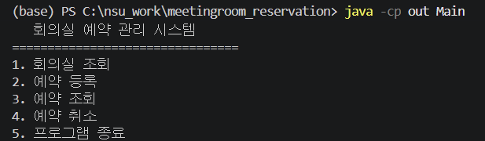

### 메뉴 1번 선택

회의실 조회 메뉴를 선택했을 때 해당 메뉴가 정상적으로
선택되는지 확인했습니다.

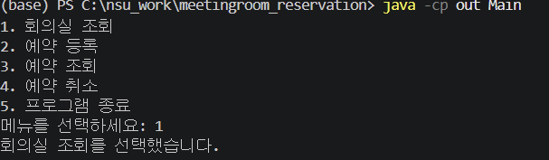

### 메뉴 2번 선택

예약 등록 메뉴를 선택했을 때 해당 메뉴가 정상적으로
선택되는지 확인했습니다.

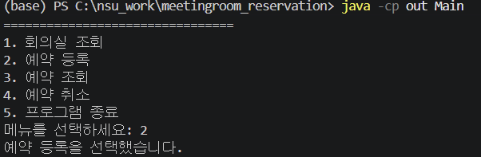

### 메뉴 5번 선택

프로그램 종료 메뉴를 선택했을 때 프로그램이 정상적으로
종료되는지 확인했습니다.

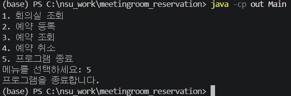

---

## 2. 회의실 목록 조회 기능 구현

기본 메뉴에서 `1. 회의실 조회`를 선택했을 때 등록된 회의실 목록이 화면에 출력되도록 구현했습니다.

회의실 번호와 회의실 이름, 수용 인원을 확인할 수 있도록 구성했으며, 등록된 회의실 정보가 정상적으로 출력되는 것을 확인했습니다.

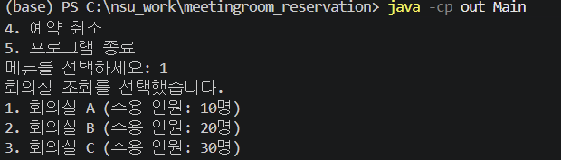

위 화면을 통해 회의실 조회 기능이 정상적으로 동작하는 것을 확인했습니다.

## 3. 예약 등록 기능 구현

기본 메뉴에서 `2. 예약 등록`을 선택했을 때 예약자 이름, 회의실 번호, 예약 날짜를 입력할 수 있도록 구현했습니다.
사용자가 입력한 예약 정보를 화면에 출력하여 예약 등록 과정이 정상적으로 처리되는 것을 확인했습니다.

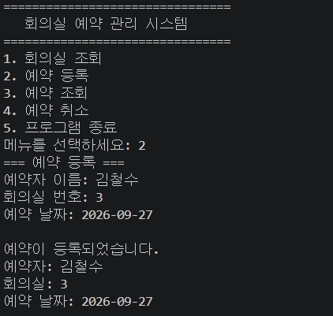

위 화면을 통해 예약자 정보와 회의실 번호, 예약 날짜가 정상적으로 입력되고 출력되는 것을 확인했습니다.
## 구현 기능

- Java 기본 메뉴 시스템 구현
- 사용자 메뉴 선택 기능 구현
- 프로그램 종료 기능 구현
- `Room` 클래스를 이용한 회의실 데이터 구성
- 회의실 목록 조회 기능 구현
- 예약자 이름 입력 기능 구현
- 회의실 번호 입력 기능 구현
- 예약 날짜 입력 기능 구현
- 예약 정보 출력 기능 구현

# Day 2 - 예약 관리 기능 구현

## 1. Reservation 클래스 구현

예약 정보를 하나의 객체로 관리하기 위해 `Reservation` 클래스를 구현했습니다.

예약 번호, 예약자 이름, 회의실 번호, 예약 날짜를 하나의 예약 정보로 관리할 수 있도록 구성했습니다.

또한 예약 정보를 화면에 출력할 수 있도록 기능을 구성하여 예약 조회 및 관리에 활용할 수 있도록 구현했습니다.

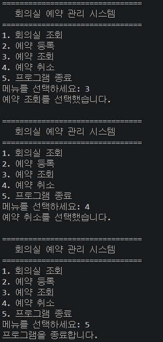

위 화면을 통해 Java 프로그램이 정상적으로 컴파일 및 실행되는 것을 확인했습니다.

## 2. 예약 등록 기능 구현

예약 등록 메뉴를 선택했을 때 예약자 이름, 회의실 번호, 예약 날짜를 입력받도록 구현했습니다.

입력받은 정보를 이용하여 `Reservation` 객체를 생성하고 예약 배열에 저장하도록 구성했습니다.

또한 현재 등록된 예약 개수를 관리하여 새로운 예약이 다음 배열 위치에 저장되도록 구현했습니다.

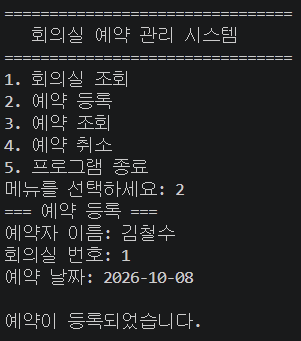

위 화면을 통해 예약자 이름, 회의실 번호, 예약 날짜를 입력하여 예약을 등록할 수 있는 것을 확인했습니다.

## 3. 여러 예약 등록 및 예약 목록 조회

예약 등록 기능을 이용하여 여러 개의 예약 정보를 등록하고, 등록된 예약을 한 번에 조회할 수 있도록 구현했습니다.

김철수와 이영희의 예약 정보를 각각 등록하여 여러 예약 정보를 관리할 수 있는 것을 확인했습니다.

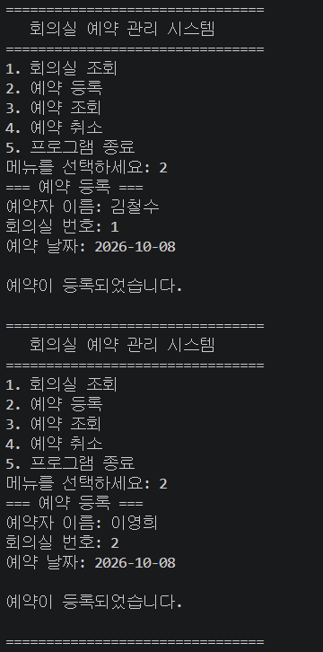

위 화면을 통해 두 개의 예약 정보가 정상적으로 등록되는 것을 확인했습니다.

등록된 예약 정보를 조회했을 때 예약 번호, 예약자 이름, 회의실 번호, 예약 날짜가 함께 출력되도록 구현했습니다.

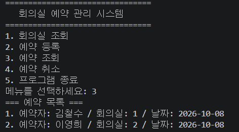

위 화면을 통해 등록된 여러 예약 정보가 정상적으로 조회되는 것을 확인했습니다.

## 4. 예약 취소 기능 구현

등록된 예약을 예약 번호를 기준으로 취소할 수 있도록 예약 취소 기능을 구현했습니다.

사용자가 취소할 예약 번호를 입력하면 해당 예약을 검색하고, 예약 배열에서 해당 정보를 제거하도록 구성했습니다.

예약이 취소된 이후에는 남아 있는 예약 정보가 정상적으로 유지되도록 구현했습니다.

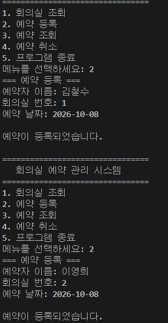

위 화면을 통해 김철수와 이영희의 예약이 정상적으로 등록된 상태를 확인했습니다.

김철수의 예약 번호를 입력하여 예약을 취소한 후 다시 예약 목록을 조회하여 취소된 예약이 목록에서 제거되는지 확인했습니다.

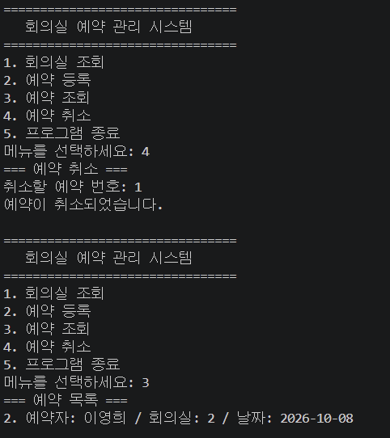

위 화면을 통해 김철수의 예약이 정상적으로 취소되고, 예약 조회 결과에 이영희의 예약만 남아 있는 것을 확인했습니다.

---

## 구현 기능

### Day 1

- Java 기본 메뉴 시스템 구현
- 사용자 메뉴 선택 기능 구현
- 프로그램 종료 기능 구현
- `Room` 클래스를 이용한 회의실 데이터 구성
- 회의실 목록 조회 기능 구현
- 예약자 이름 입력 기능 구현
- 회의실 번호 입력 기능 구현
- 예약 날짜 입력 기능 구현
- 예약 정보 출력 기능 구현

### Day 2

- `Reservation` 클래스 구현
- 예약 정보 객체 관리
- 예약 등록 기능 구현
- 예약 배열을 이용한 예약 정보 저장
- 예약 개수 관리
- 예약 목록 조회 기능 구현
- 예약 번호를 이용한 예약 검색
- 예약 취소 기능 구현
- 예약 취소 후 배열 데이터 정리
- 예약 취소 결과 확인

### 향후 구현 예정

- MySQL 데이터베이스 연동
- JDBC를 이용한 DB 연결
- 회원 등록 및 로그인
- 회의실 등록 및 관리
- 예약 정보 데이터베이스 저장
- 예약 조회
- 예약 취소
- 예약 시간 중복 방지
- 관리자 예약 관리